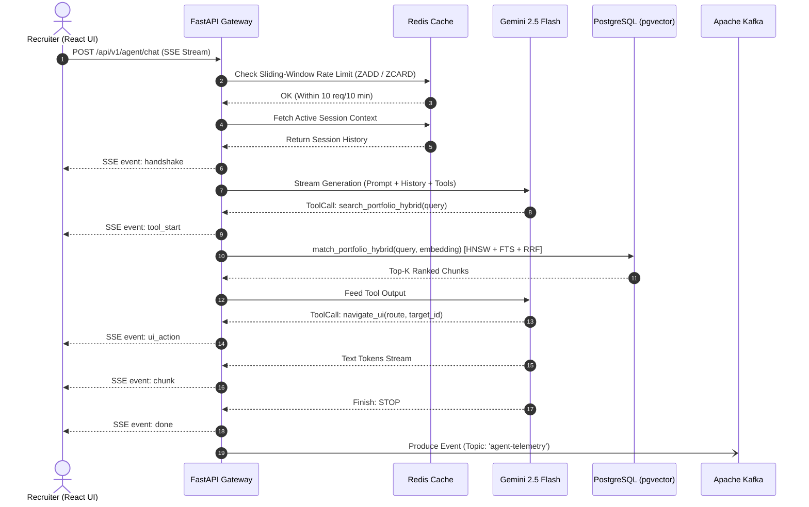

# SSD 01: Real-Time Agent Chat & Hybrid Retrieval

## 1. Flow Diagram



## 2. API Contract & Payloads
- **Endpoint:** `POST /api/v1/agent/chat`
- **Request Body:**
  ```json
  {
    "session_id": "UUID",
    "message": "string"
  }
  ```
- **SSE Events Emitted:** `handshake`, `tool_start`, `ui_action`, `chunk`, `error`, `done`.