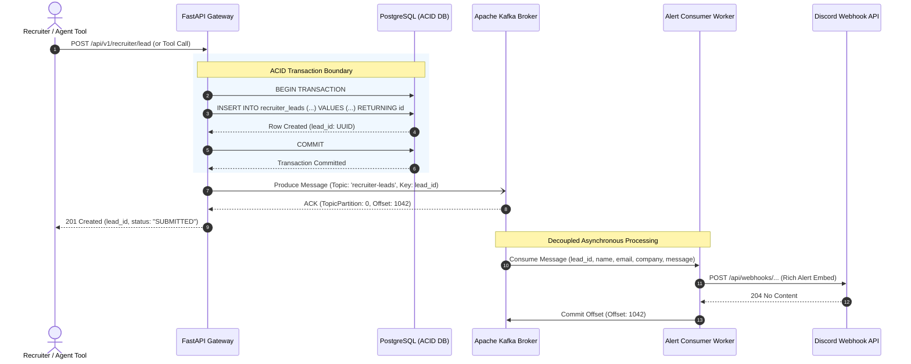

# SSD 03: Lead Capture & Asynchronous Kafka Alert Pipeline

## 1. Flow Diagram



## 2. Event & Message Schemas

### Kafka Topic: `recruiter-leads`
- **Partition Key:** `lead_id` (UUID string)
- **Payload Schema:**
```json
{
  "event_id": "a6b7c8d9-0123-4567-89ab-cdef01234567",
  "lead_id": "550e8400-e29b-41d4-a716-446655440000",
  "recruiter_name": "Jane Smith",
  "company": "Vertex AI Labs",
  "email": "jane.smith@vertex.io",
  "linkedin_url": "[https://linkedin.com/in/janesmith](https://linkedin.com/in/janesmith)",
  "message": "Loved the hybrid search implementation. Would like to set up a technical interview.",
  "salary_band": "$160,000 - $190,000 USD",
  "timestamp": "2026-08-17T17:48:55Z"
}
```

### Discord Outbound Webhook Embed
```json
{
  "username": "Portfolio Lead Bot",
  "avatar_url": "[https://raw.githubusercontent.com/user/portfolio/main/public/bot-avatar.png](https://raw.githubusercontent.com/user/portfolio/main/public/bot-avatar.png)",
  "embeds": [
    {
      "title": "🚨 New Recruiter Lead Captured!",
      "color": 5814783,
      "fields": [
        { "name": "Recruiter", "value": "Jane Smith", "inline": true },
        { "name": "Company", "value": "Vertex AI Labs", "inline": true },
        { "name": "Email", "value": "jane.smith@vertex.io", "inline": false },
        { "name": "Salary Band", "value": "$160k - $190k", "inline": true },
        { "name": "Message", "value": "Loved the hybrid search implementation...", "inline": false }
      ],
      "footer": { "text": "Lead ID: 550e8400-e29b-41d4-a716-446655440000" },
      "timestamp": "2026-08-17T17:48:55Z"
    }
  ]
}
```