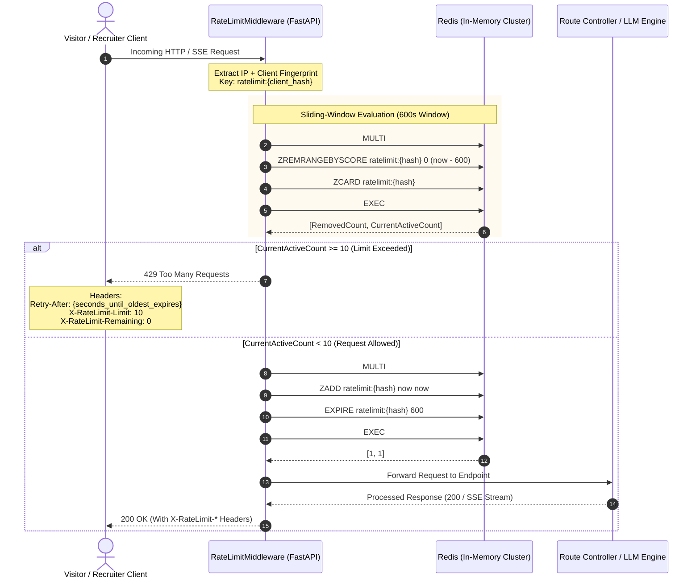

# SSD 04: Redis Sliding-Window Rate Limiting & Edge Defense

## 1. Flow Diagram



## 2. Sliding-Window Lua Script Implementation (Atomic Execution)

```lua
-- KEYS[1]: ratelimit key (e.g., 'ratelimit:ip_192.168.1.1')
-- ARGV[1]: current timestamp (epoch ms)
-- ARGV[2]: window duration (ms, e.g., 600000 for 10 min)
-- ARGV[3]: max allowed requests (e.g., 10)

local key = KEYS[1]
local now = tonumber(ARGV[1])
local window = tonumber(ARGV[2])
local limit = tonumber(ARGV[3])
local clearBefore = now - window

-- 1. Remove expired timestamps
redis.call('ZREMRANGEBYSCORE', key, '-inf', clearBefore)

-- 2. Count active hits in window
local currentRequests = redis.call('ZCARD', key)

if currentRequests < limit then
    -- 3. Add current timestamp
    redis.call('ZADD', key, now, now)
    redis.call('PEXPIRE', key, window)
    return {1, limit - currentRequests - 1, 0} -- {allowed (1=true), remaining, retry_after}
else
    -- Find oldest timestamp to compute Retry-After
    local oldest = redis.call('ZRANGE', key, 0, 0, 'WITHSCORES')
    local retryAfter = math.ceil((tonumber(oldest[2]) + window - now) / 1000)
    return {0, 0, math.max(retryAfter, 1)} -- {allowed (0=false), remaining, retry_after}
end
```

### Rate Limit Tiers
| Tier | Identifier | Limit | Window | Action on Exceeded |
| :--- | :--- | :--- | :--- | :--- |
| **Anonymous** | IP + Browser Fingerprint | 10 requests | 10 min | HTTP 429 + JSON Error |
| **Recruiter VIP** | Bearer JWT (Magic Link) | 50 requests | 10 min | HTTP 429 + Refresh Prompt |
| **Admin** | API Key Header | Unlimited | N/A | Bypass Middleware |