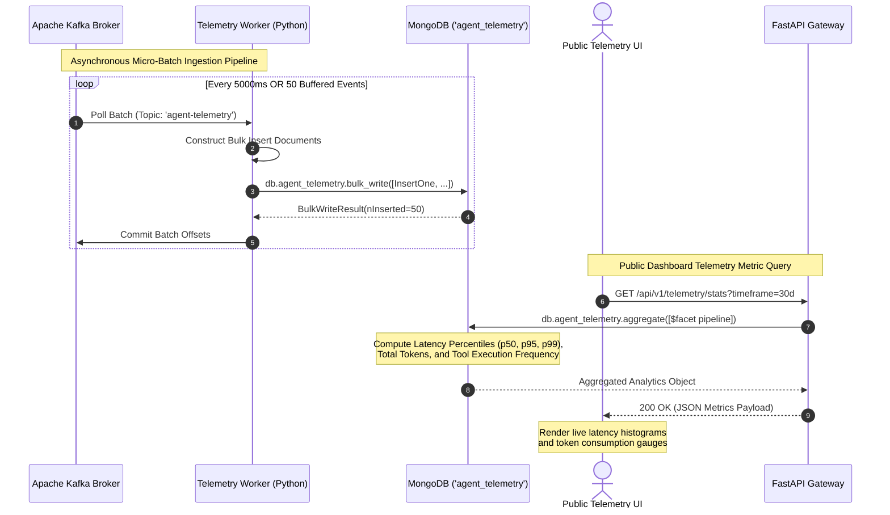

# SSD 05: Telemetry Ingestion & Public Dashboard Aggregation

## 1. Flow Diagram



## 2. API Contract & MongoDB Aggregation Pipeline

### Endpoint
`GET /api/v1/telemetry/stats`

### MongoDB Aggregation Query
```javascript
db.agent_telemetry.aggregate([
  {
    $match: {
      timestamp: { $gte: new Date(Date.now() - 30 * 24 * 60 * 60 * 1000) }
    }
  },
  {
    $facet: {
      "token_metrics": [
        {
          $group: {
            _id: null,
            total_prompt_tokens: { $sum: "$prompt_tokens" },
            total_completion_tokens: { $sum: "$completion_tokens" },
            total_tokens: { $sum: "$total_tokens" },
            total_invocations: { $sum: 1 }
          }
        }
      ],
      "latency_percentiles": [
        {
          $group: {
            _id: null,
            latencies: { $push: "$latency_breakdown.total_ms" }
          }
        },
        {
          $project: {
            p50: { $arrayElemAt: [{ $sortArray: { input: "$latencies", sortBy: 1 } }, { $floor: { $multiply: [{ $size: "$latencies" }, 0.50] } }] },
            p95: { $arrayElemAt: [{ $sortArray: { input: "$latencies", sortBy: 1 } }, { $floor: { $multiply: [{ $size: "$latencies" }, 0.95] } }] },
            p99: { $arrayElemAt: [{ $sortArray: { input: "$latencies", sortBy: 1 } }, { $floor: { $multiply: [{ $size: "$latencies" }, 0.99] } }] }
          }
        }
      ],
      "tool_frequency": [
        { $unwind: "$tool_calls_executed" },
        {
          $group: {
            _id: "$tool_calls_executed",
            count: { $sum: 1 }
          }
        },
        { $sort: { count: -1 } }
      ]
    }
  }
]);
```

### Response Payload (`200 OK`)
```json
{
  "timeframe": "past_30_days",
  "total_conversations": 1420,
  "tokens": {
    "prompt_tokens": 1284500,
    "completion_tokens": 342100,
    "total_tokens": 1626600,
    "estimated_cost_usd": 0.00
  },
  "latency": {
    "p50_ms": 420.5,
    "p95_ms": 1150.0,
    "p99_ms": 1820.4
  },
  "tool_usage": [
    { "tool": "search_portfolio_hybrid", "invocations": 1892 },
    { "tool": "navigate_ui", "invocations": 645 },
    { "tool": "explain_system_tradeoffs", "invocations": 412 },
    { "tool": "capture_recruiter_lead", "invocations": 84 }
  ],
  "system_health": {
    "gemini_api": "HEALTHY",
    "kafka_lag": 0,
    "pgvector_query_avg_ms": 4.2
  }
}
```